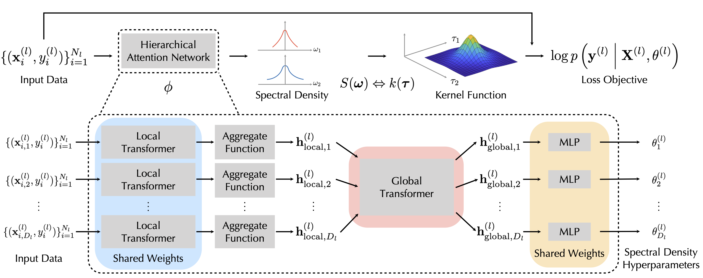

# Task-Agnostic Amortized Inference of Gaussian Process Hyperparameters (AHGP)



This repository contains code and pretrained-models for the task-agnostic amortized inference of GP hyperparameters (AHGP) proposed in our [NeurIPS 2020 paper](https://papers.nips.cc/paper/2020/hash/f52db9f7c0ae7017ee41f63c2a7353bc-Abstract.html). AHGP is a method that allows light-weight amortized inference of GP hyperparameters with a pre-trained neural model.

The repository also includes a pip installable package with the essential components of AHGP so that you can use AHGP with simple function calls.

If you find this repository helpful, please cite our NeurIPS 2020 paper:
```
@inproceedings{liu2020ahgp,
  title={Task-Agnostic Amortized Inference of Gaussian Process Hyperparameters},
  author={Liu, Sulin and Sun, Xingyuan and Ramadge, Peter J. and Adams, Ryan P.},
  booktitle={Advances in Neural Information Processing Systems},
  year={2020}
}
```


## Package installation and usage

### Installation

The essential components of AHGP are packaged in `ahgp/` and you can install this via PyPI:
```bash
pip install amor-hyp-gp
```

### Requirement

`amor-hyp-gp` has the following dependencies:
* `python >= 3.6`
* `pytorch >= 1.3.0`
* `tensorboardX`
* `easydict`
* `PyYAML`

### Usage

Usage examples are included in `examples/`.

`example_ahgp_inference.py` contains an example of full GP inference, which uses amortized GP hyperparameter inference and full GP prediction implemented in `PyTorch`.

`example_ahgp_hyperparameters.py` contains an example that outputs the GP hyperprameters (means and variances of the Gaussian mixtures for modeling the spectral density).

`config/model.yaml` provides a example configuration file of the pretrained model to be used for amortized inference. 

In `pretrained_model/`, we provided the pretrained model used in our paper, which is trained on 5000 synthetic datasets of relative small size generated from stationary GP priors. We also encourage you to try with your own pretrained model for your specific problem.

## Code for training and running the models

### Generating synthetic data for training
An example of generating synthetic training data from GP priors with stationary kernels is provided in `get_data_gp.py`.

### Running experiments described in the AHGP paper
To run the experiments, you will need the following extra dependencies:
* `GPy`
* `emukit`

The UCI regression benchmark datasets are stored in `data/regression_datasets`. The Bayesian optimization functions are implemented in `utils/bo_function.py`. The Bayesian quadrature functions are imported from the `emukit` package.

**Training model**

To train a neural model for amortized inference, you can run:
```bash
python run_exp.py -c config/train.yaml
```
In `config/train.yaml`, you can define the configurations for the neural model and training hyperparameters. 

**Regression experiments**

To run the regression benchmark experiments with the pretrained neural model, use:
```bash
python run_exp.py -c config/regression.yaml -t
```
In `config/regression.yaml`, you can define the configurations of the pretrained model and the regression experiment.

**Bayesian optimization experiments**

To run the Bayesian optimization experiments with the pretrained neural model, use:
```bash
python run_exp_bo.py -c config/bo.yaml
```
In `config/bo.yaml`, you can define the configurations of the pretrained model and the BO experiment.

**Bayesian quadrature experiments**

To run the Bayesian quadrature experiments with the pretrained neural model, use:
```bash
python run_exp_bq.py -c config/bq.yaml
```
In `config/bq.yaml`, you can define the configurations of the pretrained model and the BQ experiment.

## Authors:
* [Sulin Liu](https://liusulin.github.io/)
* [Xingyuan Sun](http://people.csail.mit.edu/xingyuan/)
* [Peter J. Ramadge](https://ee.princeton.edu/people/peter-j-ramadge)
* [Ryan P. Adams](https://www.cs.princeton.edu/~rpa/)

Please reach out to us with any questions! 